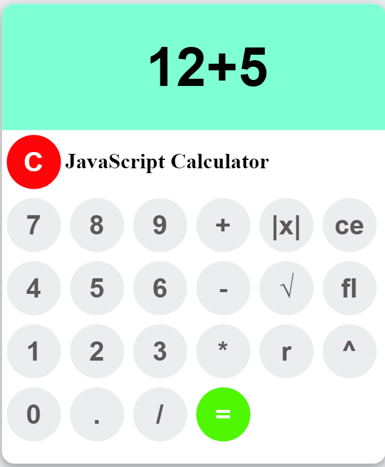

# Advanced JavaScript Calculator

This project is an advanced calculator built with **JavaScript**. The calculator supports the following operations:

- **Addition** (`+`)
- **Subtraction** (`-`)
- **Multiplication** (`*`)
- **Division** (`/`)
- **Floor** (`Math.floor`)
- **Ceil** (`Math.ceil`)
- **Round** (`Math.round`)
- **Power** (`Math.pow`)
- **Absolute Value** (`Math.abs`)

## Features
The calculator performs both basic arithmetic operations and advanced mathematical calculations. It's designed to handle inputs efficiently and display results accurately.

### Technologies Used
- **HTML**: For the structure of the calculator interface.
- **CSS**: For styling and creating a user-friendly design.
- **JavaScript**: For implementing the calculator's logic and operations.

## How to Use
1. Clone or download the repository.
2. Open the `index.html` file in your browser.
3. Use the calculator interface to perform operations:
   - Enter numbers and select the desired operation.
   - The result will be displayed on the screen.

## Demo



## Installation
1. Clone the repository:
   ```bash
   git clone https://github.com/your-username/your-repo-name.git
